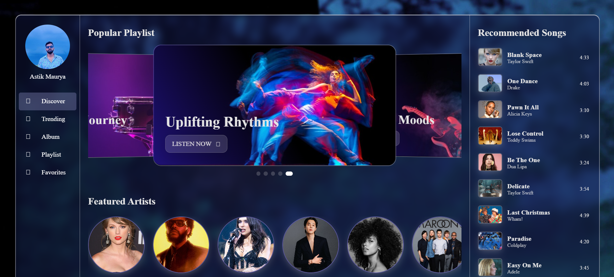

# Music Player Dashboard with Sliders

Welcome to the **Music Player Dashboard** project! This project is perfect for beginners looking to practice their frontend development skills. It provides a basic yet functional interface for playing music, built using HTML, CSS, and JavaScript. The goal is to create a responsive dashboard that works well on various devices.

## Features

- **Basic Music Controls:** Play, pause, next and previous music.
- **Interactive Slider:**  Intuitive sliders for track progress.
- **Responsive Design:** Ensures a decent user experience across different screen sizes.
- **Song Information:** Displays basic information about the currently playing track.

## Screenshots




## Getting Started

### Prerequisites

- A modern web browser (Chrome, Firefox, Safari, etc.)

### Usage

1. Clone the repository:

   ```bash
   git clone https://github.com/your-username/music-player-dashboard.git
   ```

2. Open the project folder in your code editor.

3. Launch the `index.html` file in your web browser.

4. Start playing around with the music controls and sliders.

## Customization

This project is a great starting point for customization. Experiment with the code and try out different styles or features. Here are some ideas:

- **Colors:** Change the color scheme in the CSS file to match your preferences.
- **Icons:** Add or replace icons for the music controls.
- **Additional Features:** Experiment with adding more controls or information.

## Contributing

This project is open to contributions! If you're a beginner looking to make your first open-source contribution, follow these steps:

1. Fork the repository.

2. Create a new branch:

   ```bash
   git checkout -b feature/your-feature-name
   ```

3. Make your changes and commit them:

   ```bash
   git add .
   git commit -m "Add your feature or fix"
   ```

4. Push to the branch:

   ```bash
   git push origin feature/your-feature-name
   ```

5. Open a pull request.

## License

This project is licensed under the [MIT License](LICENSE). Feel free to use it as a learning resource or as a starting point for your own projects.

## Acknowledgments

- This project is meant for beginners to practice their frontend skills.
- Don't hesitate to explore and modify the code to enhance your understanding.

Thank you for checking out the Simple Music Player Dashboard! Have fun coding and experimenting! 🎵
